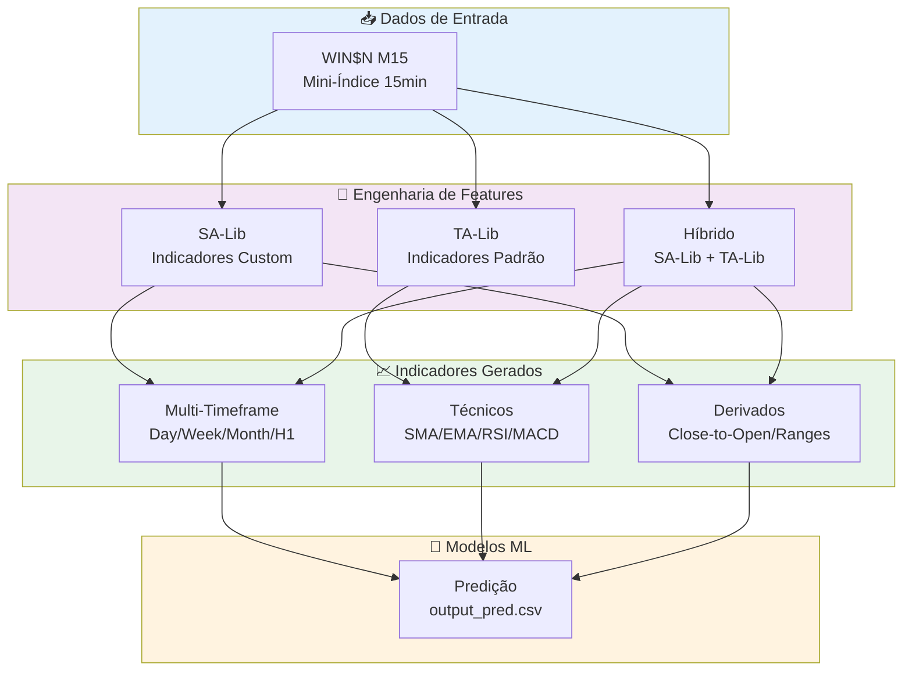

<div align="center">

# 📊 Feature Experiments

**[Português](#português) | [English](#english)**


*Plataforma de experimentação de features financeiras para modelos de Machine Learning aplicados ao mercado financeiro / Financial feature experimentation platform for ML models applied to financial markets*

</div>

---

## Português

### 📋 Visão Geral

O **Feature Experiments** é uma plataforma de experimentação para engenharia de features financeiras, focada na criação e avaliação de indicadores técnicos para modelos de Machine Learning aplicados ao mercado financeiro brasileiro (B3 - WIN$N mini-índice).

O projeto compara três abordagens de geração de features:
- **SA-Lib (Custom)**: Biblioteca proprietária de indicadores customizados
- **TA-Lib**: Biblioteca padrão da indústria (Technical Analysis Library)
- **SA-Lib + TA-Lib**: Combinação híbrida das duas abordagens

### 🏗️ Arquitetura



### 📁 Estrutura do Projeto

```
FeatureExperiments/
├── experimentos_salib/           # Experimentos com SA-Lib (custom)
│   ├── experimentos_salib.ipynb  # Notebook de análise
│   ├── myfeatures.py             # Features customizadas
│   ├── myindicators.py           # Indicadores técnicos
│   ├── salib.py                  # Biblioteca SA-Lib
│   ├── WIN$N_M15.csv             # Dados do mini-índice
│   └── output_pred.csv           # Resultados de predição
├── experimentos_talib/           # Experimentos com TA-Lib
│   ├── experimentos_talib.ipynb  # Notebook de análise
│   ├── myfeatures.py             # Features com TA-Lib
│   ├── myindicators.py           # Newton features + TA-Lib
│   ├── salib.py                  # Funções auxiliares
│   └── WIN$N_M15.csv             # Dados do mini-índice
├── experimentos_talib+salib/     # Experimentos híbridos
│   ├── experimentos_talib_salib.ipynb
│   ├── myfeatures.py             # Features combinadas
│   ├── myindicators.py           # Todos os indicadores
│   └── salib.py                  # Funções auxiliares
└── Anexo A - Experimentos.pdf    # Documentação dos experimentos
```

### 🔬 Features Implementadas

#### SA-Lib (Custom)
- **Multi-Timeframe Transform**: Conversão de candles entre timeframes (M15→Day/Week/Month/H1)
- **Close-to-Open (CTO)**: Variação percentual entre fechamento e abertura em múltiplos períodos
- **Range Analysis**: Amplitude intraday em pontos e percentual
- **Newton Features**: Máximas/mínimas de N dias anteriores com janela deslizante

#### TA-Lib
- **Médias Móveis**: SMA, EMA em múltiplos períodos
- **Osciladores**: RSI, Stochastic, CCI, Williams %R
- **Tendência**: MACD, ADX, Parabolic SAR
- **Volatilidade**: Bollinger Bands, ATR
- **Volume**: OBV, AD Line, MFI

### 🏭 Aplicações na Indústria

| Setor | Aplicação |
|-------|-----------|
| **Trading Quantitativo** | Geração de sinais alpha com features multi-timeframe |
| **Gestão de Risco** | Indicadores de volatilidade para dimensionamento de posição |
| **Fundos de Investimento** | Backtesting de estratégias com feature selection |
| **Prop Trading** | Modelos de predição para day trading no mini-índice |
| **Fintech** | Algoritmos de recomendação de investimento |

### 🚀 Como Executar

```bash
# Clonar o repositório
git clone https://github.com/galafis/FeatureExperiments.git
cd FeatureExperiments

# Instalar dependências
pip install numpy pandas matplotlib ta-lib

# Executar notebooks
jupyter notebook experimentos_salib/experimentos_salib.ipynb
```

---

## English

### 📋 Overview

**Feature Experiments** is a financial feature engineering experimentation platform, focused on creating and evaluating technical indicators for Machine Learning models applied to the Brazilian financial market (B3 - WIN$N mini-index futures).

The project compares three approaches for feature generation:
- **SA-Lib (Custom)**: Proprietary custom indicator library
- **TA-Lib**: Industry-standard Technical Analysis Library
- **SA-Lib + TA-Lib**: Hybrid combination of both approaches

### 🏗️ Architecture

*See the Mermaid diagram in the [Portuguese section](#arquitetura) above.*

### 🔬 Implemented Features

#### SA-Lib (Custom)
- **Multi-Timeframe Transform**: Candle conversion between timeframes (M15→Day/Week/Month/H1)
- **Close-to-Open (CTO)**: Percentage change between close and open across multiple periods
- **Range Analysis**: Intraday amplitude in points and percentage
- **Newton Features**: Highs/lows from N previous days with sliding window

#### TA-Lib
- **Moving Averages**: SMA, EMA across multiple periods
- **Oscillators**: RSI, Stochastic, CCI, Williams %R
- **Trend**: MACD, ADX, Parabolic SAR
- **Volatility**: Bollinger Bands, ATR
- **Volume**: OBV, AD Line, MFI

### 🏭 Industry Applications

| Sector | Application |
|--------|-------------|
| **Quantitative Trading** | Alpha signal generation with multi-timeframe features |
| **Risk Management** | Volatility indicators for position sizing |
| **Investment Funds** | Strategy backtesting with feature selection |
| **Prop Trading** | Prediction models for day trading on mini-index futures |
| **Fintech** | Investment recommendation algorithms |

### 🚀 Getting Started

```bash
# Clone the repository
git clone https://github.com/galafis/FeatureExperiments.git
cd FeatureExperiments

# Install dependencies
pip install numpy pandas matplotlib ta-lib

# Run notebooks
jupyter notebook experimentos_salib/experimentos_salib.ipynb
```

---

## 👤 Autor / Author

**Gabriel Demetrios Lafis**
- GitHub: [@galafis](https://github.com/galafis)
- LinkedIn: [Gabriel Demetrios Lafis](https://linkedin.com/in/gabriel-demetrios-lafis)

## 📄 Licença / License

This project is licensed under the MIT License - see the [LICENSE](LICENSE) file for details.
